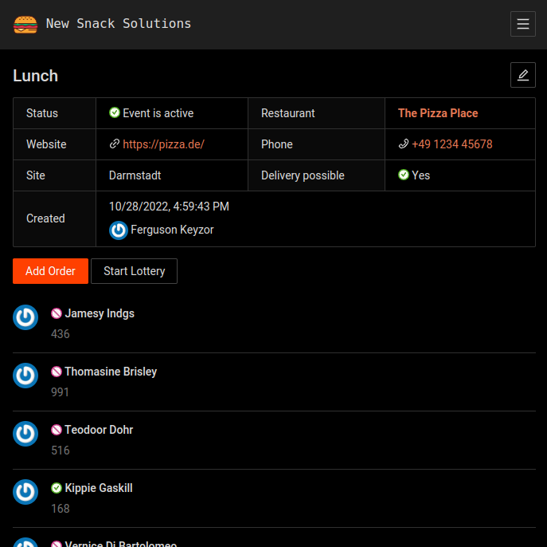

# Food

This application enables you to discover people within your organisation to have a meal with and to decide on who has to order the food randomly.



The main purpose is to serve as a playground for testing out a [Kotlin backend with automatic GraphQL schema generation](https://github.com/ExpediaGroup/graphql-kotlin) in combination with a React frontend and [automatic TypeScript code generation](https://github.com/dotansimha/graphql-code-generator).

## Deployment

The application supports multiple (company) sites/locations. There is currently no frontend for this, so you need to add the sites manually to the database.

You can optionally set a Teams webhook connector url for a site to receive notifications in a Teams channel.

### Kubernetes

Build the container image and push it to a registry of your choice. Then use the included Helm chart to deploy the application.

You need to configure the required values.

| Name | Description | Required |
|---|---|---|
| `image.repository` | The registry url where you pushed the image to | Yes |
| `config.DATABASE_HOST` | MariaDB server host | Yes |
| `config.DATABASE_PORT` | Database port | No (defaults to `3306`)|
| `config.DATABASE_NAME` | Database name | Yes |
| `config.DATABASE_USER` | Database username | Yes |
| `secret.DATABASE_PASSWORD` | Database password | Yes |
| `config.SPRING_MAIL_HOST` | SMTP server host | Yes |
| `config.SPRING_MAIL_USERNAME` | SMTP username | Yes |
| `config.SPRING_SECURITY_OAUTH2_CLIENT_PROVIDER_OIDC_ISSUER_URI`| OIDC issuer URL of your IDP | Yes |
| `secret.SPRING_SECURITY_OAUTH2_CLIENT_REGISTRATION_OIDC_CLIENT_ID` | OIDC client id | Yes |
| `secret.SPRING_SECURITY_OAUTH2_CLIENT_REGISTRATION_OIDC_CLIENT_SECRET` | OIDC client secret | Yes |
| `existingSecrets` | An array of existing secrets if you do not want the chart to create the secrets for you. The included keys should be the same as for config/secret described above. | No |

## Development

*Below commands are meant to be run from the root of this repository.*

### Setup

#### 1. Build Images

First build the container images:
```shell
docker-compose build
```

#### 2. Generate the GraphQL Schema and Code

The backend generates and exposes a GraphQL API that is used by the frontend.

To output the schema SDL to a file and generate the frontend TypeScript code out of it run:
```shell
tools/gql-gen
```

#### 3. Configure

Create a `docker-compose.override.yml` file and add your identity provider settings (see above):

```yaml
services:
  backend:
    environment:
      SPRING_SECURITY_OAUTH2_CLIENT_REGISTRATION_OIDC_CLIENT_ID:
      SPRING_SECURITY_OAUTH2_CLIENT_REGISTRATION_OIDC_CLIENT_SECRET:
      SPRING_SECURITY_OAUTH2_CLIENT_PROVIDER_OIDC_ISSUER_URI:
```

#### 4. Start Containers

Now start the application and make sure every container comes up. When there are errors it might help to just execute the command again. E.g. the backend might come up before the database is ready.
```shell
docker-compose up
```

If everything went fine you should be able to access the application at http://localhost:8080.

The backend is configured to proxy requests to the frontend dev server. This way the authentication can run before serving the frontend.

### Auto Backend Builds

To rebuild and restart the backend on change run the following in another shell.
```shell
tools/builder
```

### E-Mails

An instance of [MailHog](https://github.com/mailhog/MailHog) is available at http://localhost:8025/ to debug emails locally.

### Reset the Database

To reset the database and load some test data run:
```shell
tools/reset
```

### Generating Migrations

Apply all existing migrations to the database. Now change the model and rebuild the application.
```shell
docker-compose exec backend gradle build -x test
```

When the build is successful you can generate a migration:
```shell
docker-compse exec backend gradle diffChangeLog
```

This adds a file at `backend/src/main/resources/db/changelog/new.yaml`.

Check the auto generated change sets and remove everything that has nothing to do with your change (the diff is not that great).

Rename the file similar to the existing migrations and add an include to [`db.changelog-master.yaml`](backend/src/main/resources/db/changelog/db.changelog-master.yaml).
